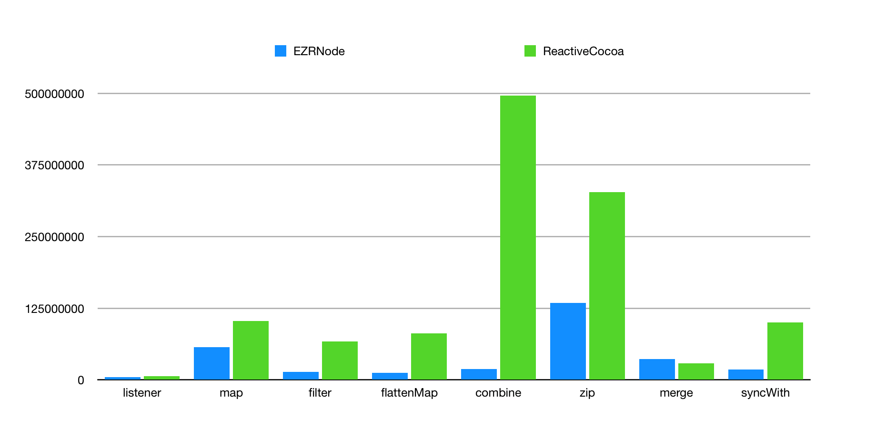

# 

[](https://travis-ci.org/WilliamZang/EasyReact)
[](http://cocoapods.org/pods/EasyReact)
[](http://cocoapods.org/pods/EasyReact)
[](http://cocoapods.org/pods/EasyReact)

*其他语言版本：[English](README.md)*

## EasyReact 是什么

EasyReact 是一个简单易用的响应式编程库。

## 为什么要使用 EasyReact

你是否对 RxSwift 和 ReactiveCocoa 中的 functor、applicative、monad 感到困惑不解？没关系，那些概念太复杂了，以至于并没有多少人真的在实际项目中使用它们。有没有简单易用的响应式编程方式呢？EasyReact 就是为此而生的，来试试吧。

## 特性

注：以下列出的“节点”均指`EZRNode`，即 EasyReact 中对各种值（所有对象类型）的一种统一表示。

- [x] [创建节点或可变节点](./Documents/Chinese/BasicOperators.md#创建节点)
- [x] [立即获得节点的值](./Documents/Chinese/BasicOperators.md#获取即时值)
- [x] [对节点的未来值进行监听](./Documents/Chinese/BasicOperators.md#监听节点值)
- [x] [取消对一个节点的监听](./Documents/Chinese/BasicOperators.md#监听节点值)
- [x] [以某种形式连接两个点](./Documents/Chinese/BasicOperators.md#连接两个节点)
- [x] [对一个节点进行基本变换](./Documents/Chinese/BasicOperators.md#基本变换)
  - [x] [map](./Documents/Chinese/BasicOperators.md#map)
  - [x] [filter](./Documents/Chinese/BasicOperators.md#filter)
  - [x] [distinctUntilChanged](./Documents/Chinese/BasicOperators.md#distinctuntilchanged)
  - [x] [throttle](./Documents/Chinese/BasicOperators.md#throttle)
  - [x] [skip](./Documents/Chinese/BasicOperators.md#skip)
  - [x] [take](./Documents/Chinese/BasicOperators.md#take)
  - [x] [deliverOn](./Documents/Chinese/BasicOperators.md#deliveron)
  - [x] [delay](./Documents/Chinese/BasicOperators.md#delay)
  - [x] [scan](./Documents/Chinese/BasicOperators.md#scan)
- [x] [对多个节点进行组合](./Documents/Chinese/BasicOperators.md#组合)
  - [x] [combine](./Documents/Chinese/BasicOperators.md#combine)
  - [x] [merge](./Documents/Chinese/BasicOperators.md#merge)
  - [x] [zip](./Documents/Chinese/BasicOperators.md#zip)
- [x] [对一个节点进行分支得到多个节点](./Documents/Chinese/BasicOperators.md#分支)
  - [x] [switch-case-default](./Documents/Chinese/BasicOperators.md#switch-case-default)
  - [x] [if-then-else](./Documents/Chinese/BasicOperators.md#if-then-else)
- [x] [对多个节点进行值同步](./Documents/Chinese/BasicOperators.md#同步)
  - [x] [syncWith](./Documents/Chinese/BasicOperators.md#syncwith)
  - [x] [手动同步](./Documents/Chinese/BasicOperators.md#手动同步)
- [x] [对节点进行高阶变换](./Documents/Chinese/BasicOperators.md#高阶变换)
  - [x] [flatten](./Documents/Chinese/BasicOperators.md#flatten)
  - [x] [flattenMap](./Documents/Chinese/BasicOperators.md#flattenmap)
- [x] [对节点和边进行遍历](./Documents/Chinese/BasicOperators.md#图遍历)
  - [x] [简单访问](./Documents/Chinese/BasicOperators.md#简单访问)
  - [x] [访问器模式](./Documents/Chinese/BasicOperators.md#访问器模式)

## 了解更多

1. [框架概述](./Documents/Chinese/FrameworkOverview.md)

2. [基本操作](./Documents/Chinese/BasicOperators.md)

3. [内存管理](./Documents/Chinese/MemoryManagement.md)

4. [如何贡献](./Documents/Chinese/CONTRIBUTING_Chinese.md)

## 对比其他函数响应式库（例如 [ReactiveCocoa](https://github.com/ReactiveCocoa/ReactiveCocoa) 或 [ReactiveX](https://github.com/ReactiveX))

| 项目        | EasyReact                                                                  | ReactiveCocoa     | ReactiveX  |
| :---------: | :------------------------------------------------------------------------: | :---------------: | :--------: |
| 核心概念      | 图论和面向对象编程                                                                  | 函数式编程             | 函数式编程和泛型编程 |
| 传播可变性     | ✅                                                                          | ❌                 | ❌          |
| 基本变换      | ✅                                                                          | ✅                 | ✅          |
| 组合变换      | ✅                                                                          | ✅                 | ✅          |
| 高阶变换      | ✅                                                                          | ✅                 | ✅          |
| 遍历节点 / 信号 | ✅                                                                          | ❌                 | ❌          |
| 多语言支持     | Objective-C （其他语言开源计划中）                                                    | Objective-C、Swift | 大量语言       |
| 性能        | 较快                                                                         | 慢                 | 快          |
| 中文文档支持    | ✅                                                                          | ❌                 | ❌          |
| 调试工具      | [拓扑图展示](./Documents/Chinese/BasicOperators.md#简单访问) <br>更多丰富的动态调试工具（开源计划中） | Instrument        | ❌          |

## 系统需求

- iOS 8.0 +
- Xcode 8.0 +

## 如何运行示例项目

clone 本项目，在 Example 文件夹下执行`pod install`，然后打开`EasyReact.xcworkspace`.

## 安装

### CocoaPods

在`Podfile`中添加

```ruby
pod 'EasyReact'
```

然后运行`pod install`即可

## 如何使用 (如需更详细的例子，请查看示例工程 Tests 文件夹下的测试用例)

### 单元测试

EasyReact 包含了完善的单元测试，相关代码在 Example/Tests 文件夹下。你可以打开示例工程并执行 Test 命令来运行这些单元测试。

## EasyReact, ReactiveCocoa, RxSwift 常见API 基于耗时的 Benchmarking

### 测试环境

Mac OS  10.12.6, CPU: 2.9GHz, Core i5
Xcode 9, iOS11, iPhone 8 Plus simulator

### 测试对象

1. listener, map, filter, flattenMap等单阶操作
2. combine, zip, merge等多点聚合操作
3. syncWith操作

其中测试的规模基于操作对象个数10，触发次数1000。如Listener方法  有10个监听者，重复触发发送值的行为1000次。
时间单位为ns。

### 测试数据

重复上面的实验10次，得到数据平均值如下：

| name          | listener | map       | filter   | flattenMap | combine   | zip       | merge    | syncWith  |
| ------------- | -------- | --------- | -------- | ---------- | --------- | --------- | -------- | --------- |
| EZRNode       | 4775053  | 57487844  | 13851412 | 11966681   | 18972713  | 134567221 | 36076535 | 18388601  |
| ReactiveCocoa | 6273485  | 102644235 | 66771529 | 80881225   | 496207382 | 327464977 | 29010632 | 100022454 |
| RAC:EZRNode   | 131.38%  | 178.55%   | 482.06%  | 675.89%    | 2615.37%  | 243.35%   | 80.41%   | 543.94%   |



### 结果总结

基于Objective-C语言实现的EasyReact和ReactiveCocoa： 

ReactiveCocoa 平均耗时是 EasyReact 的 618.87%

EasyReact 的 swift 版本即将开源，届时会和 RxSwift 进行 benchmark 的比较。

## 作者

William Zang, [chengwei.zang.1985@gmail.com](mailto:chengwei.zang.1985@gmail.com)  
姜沂, [nero_jy@qq.com](mailto:nero_jy@qq.com)  
Qin Hong, [qinhong@face2d.com](mailto:qinhong@face2d.com)  
SketchK, [zhangsiqi1988@gmail.com](mailto:zhangsiqi1988@gmail.com)  
zesming, [ming9010@gmail.com](mailto:ming9010@gmail.com)  
Zhiyu Wong, [www312422@vip.qq.com](mailto:www312422@vip.qq.com)  
johnnywjy, [johnny.wjy07@gmail.com](mailto:johnny.wjy07@gmail.com)  
qiezishu, [qiezishu@yahoo.com](mailto:qiezishu@yahoo.com)  

## 许可证

EasyReact 使用 [Apache Public License 2.0 许可证](./LICENSE)。
