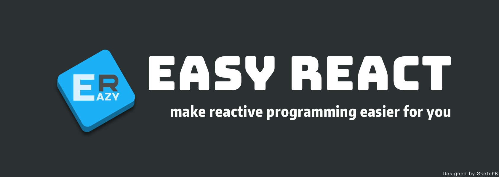
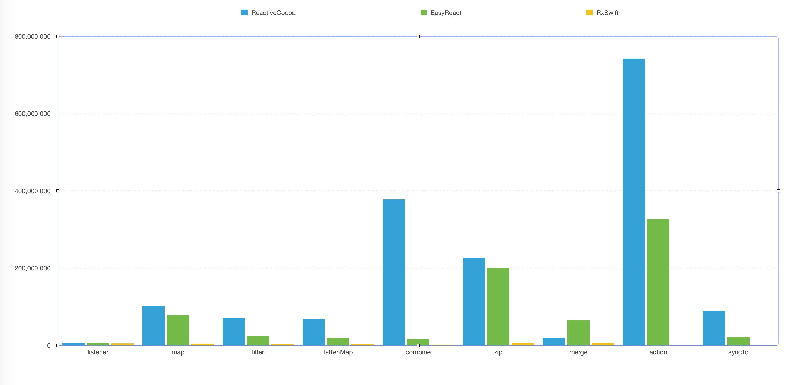

[](https://travis-ci.org/meituan/EasyReact)
[](http://cocoapods.org/pods/EasyReact)
[](http://cocoapods.org/pods/EasyReact)
[](http://cocoapods.org/pods/EasyReact)


## EasyReact 是什么?

EasyReact 是一个简单易用的响应式编程库。

## 为什么要使用 EasyReact?

你是否对 RxSwift 和 ReactiveCocoa 中的 functor、applicative、monad 感到困惑不解？没关系，那些概念太复杂了，以至于并没有多少人真的在实际项目中使用它们。有没有简单易用的响应式编程方式呢？EasyReact 就是为此而生的，来试试吧。

## 特性

注：以下列出的"值"均指`ERNode` ，即 EasyReact 中对各种值（所有`id`类型）的一种统一表示。

+ [x] 开始／停止对一个值／UIControl 事件的监听 
+ [x] 为一个值添加／删除上游
+ [x] 为一个值添加／删除下游
+ [x] 对一个值做 map / filter
+ [x] 对一个值做 flatten / flattenMap
+ [x] 对若干值做 zip / combine 生成一个新值
+ [x] 对监听的值去重
+ [x] 监听时取前 N 个值／跳过前 N 个值
+ [x] 监听时跳过特定值
+ [x] 监听多个值的组合
+ [x] 开始监听后修改组合
+ [x] 将多个值组合成一个值，并监听此值
+ [x] 将多个值 merge 成一个流，并监听每一个新值
+ [x] merge 之后修改流的组成
+ [x] 将监听回调派发到指定的queue
+ [x] 易用的 KVO & KVC
+ [x] 同步两个值
+ [x] 同步多个值
+ [x] 自动内存管理

## 系统需求

+ iOS 8.0+
+ Xcode 8.0+

## 如何运行示例项目

clone 本项目，在 Example 文件夹下执行`pod install`，然后打开`EasyReact.xcworkspace`.

## 安装

### CocoaPods

在`Podfile`中添加

```ruby
pod 'EasyReact'
```
然后运行`pod install`即可

## 如何使用 (如需更详细的例子，请查看示例工程 Tests 文件夹下的测试用例)

### ERNode 的基础用法

```objective-c
ERNode *testNode = [ERNode value:@1];
// testNode.value => @1
testNode.value = @2;
// testNode.value => @2
```

### 监听 ERNode

```objective-c
ERNode<NSNumber *> *testNode = [ERNode value:@1];

NSMutableArray<NSNumber *> *array = [NSMutableArray array];
[testNode listen:^(NSNumber *next) {
    [array addObject:next];
}];

testNode.value = @2;
testNode.value = @3;

// array => @[@1, @2, @3]
```

### 取消对 ERNode 的监听

```objective-c
ERNode<NSNumber *> *testNode = [ERNode value:@1];

NSMutableArray<NSNumber *> *array = [NSMutableArray array];
id<ERCancelable> cancelable = [testNode listen:^(NSNumber *next) {
    [array addObject:next];
}];

testNode.value = @2;
[cancelable cancel];
testNode.value = @3;

// array => @[@1, @2]
```

### 为 ERNode 设置一个上游

```objective-c
ERNode<NSNumber *> *node1 = [ERNode value:@1];
ERNode<NSNumber *> *node2 = ERNode.new;
            
[node2 linkTo:node1];
// node2 => @1
            
node1.value = @2;
// node2 => @2
```

### 移除上游

```objective-c
ERNode<NSNumber *> *node1 = [ERNode value:@1];
ERNode<NSNumber *> *node2 = ERNode.new;
[node2 linkTo:node1];
[node2 removeUpstreamNode:node1];
node1.value = @2;
// node2 => @1
```


### 移除下游

```objective-c
ERNode<NSNumber *> *node1 = [ERNode value:@1];
ERNode<NSNumber *> *node2 = ERNode.new;
[node2 linkTo:node1];
[node1 removeDownstreamNode:node2];
node1.value = @2;
// node2 => @1
```

### 对 ERNode 执行 map

```objective-c
ERNode<NSNumber *> *testNode = [ERNode value:@1];
ERNode *mappedNode = [testNode map:^id(NSNumber *next) {
    return @(next.integERNode * 2);
}];

testNode.value = @8;
// mappedNode.value => @16
```

### 对 ERNode 执行 filter

```objective-c
ERNode<NSNumber *> *testNode = [ERNode value:@1];
ERNode *filteredNode = [testNode filter:^BOOL(NSNumber *next) {
    return next.integERNode > 2;
}];
// filteredNode is empty
testNode.value = @8;
testNode.value = @0;
// filteredNode => @8
testNode.value = @5;
testNode.value = @2;
// filteredNode => @5
```

### 取前N个值

```objective-c
ERNode<NSNumber *> *testNode = [ERNode value:@1];
ERNode<NSNumber *> *takenNode = [testNode take:3];
// takenNode =>@1
testNode.value = @2;
// takenNode =>@2
testNode.value = @3;
// takenNode =>@3
testNode.value = @4;
// takenNode =>@3
testNode.value = @5;
// takenNode =>@3
```

### 跳过前N个值

```objective-c
ERNode<NSNumber *> *testNode = [ERNode value:@1];
ERNode<NSNumber *> *takenNode = [testNode skip:2];
testNode.value = @2;
// skipped
testNode.value = @3;
// takenNode =>@3
testNode.value = @4;
// takenNode =>@4
testNode.value = @5;
// takenNode =>@5
```

### 忽略特定的值

```objective-c
ERNode<NSNumber *> *testNode = [ERNode value:@1];
ERNode<NSNumber *> *ignoredNode = [testNode ignore:@5];
// ignoredNode => @1
testNode.value = @2;
// ignoredNode => @2
testNode.value = @5;
// ignored
testNode.value = @6;
// ignoredNode => @6
testNode.value = @5;
// ignored
```

### 组合多个 ERNode

```objective-c
ERNode *node1 = [ERNode value:@1];
ERNode *node2 = [ERNode value:@"1"];

ERNode *node3 = [ERNode combine:@[node1, node2]];
// node3 => @[@1, @"1"]
node1.value = @2;
// node3 => @[@2, @"1"]
node2.value = @"2";
// node3 => @[@2, @"2"]
node1.value = @3;
// node3 => @[@3, @"2"]
```

### 组合后修改数据源

```objective-c
ERNode *nodeA = [ERNode value:@1];
ERNode *nodeB = [ERNode value:@"1"];
ERNode *nodeC = [ERNode value:@NO];

ERNode *value = [ERNode combine:@[nodeA, nodeB]];
// value.value => @[@1, @"1"]
[value linkTo:nodeC];
// value.value => @NO
[nodeB removeDownstreamNode:value];
// value.value => @NO
```

### 多个 ERNode 组合成一个值

```objective-c
ERNode *node1 = [ERNode value:@1];
ERNode *node2 = [ERNode value:@1];

ERNode *node3 = [ERCombine(node1, node2) mapEach:^id(id arg1, id arg2) {
    return @([arg1 integERNode] + [arg2 integERNode]);
}];
node1.value = @2;
// node3.value => @3
node2.value = @7;
// node3.value => @9
node2.value = @1;
// node3.value => @3
```

### 将多个ERNode merge 成一个流

```objective-c
ERNode *node1 = [ERNode value:@1];
ERNode *node2 = [ERNode value:@2];

ERNode *node3 = [ERNode merge:@[node1, node2]];
// node3.value => @2
node1.value = @3;
// node3.value => @3
node2.value = @9;
// node3.value => @9
node1.value = @3;
// node3.value => @3
```


### 同步两个 ERNode

```objective-c
ERNode *node1 = [ERNode value:@1];
ERNode *node2 = [ERNode value:@2];

[node1 syncTo:node2];
// node2.value => @1

node1.value = @3;
// node2.value => @3

node2.value = @"test";
// node1.value = @"test"
```

### 取消同步

```objective-c
ERNode *node1 = [ERNode value:@1];
ERNode *node2 = [ERNode value:@2];

id<ERCancelable> cancelable = [node1 syncTo:node2];
// node2.value => @1

[cancelable cancel];

node1.value = @3;
// node2.value => @1

node2.value = @"test";
// node1.value => @3
```

### KVO & KVC

```objective-c
// TestKVOClass has 3 string properties: property1, property2 and property3
TestKVOClass *obj1 = [TestKVOClass new];
TestKVOClass *obj2 = [TestKVOClass new];

obj2.er_path[@"property3"] = obj1.er_path[@"property1"];

obj1.property1 = @"xxx";
// obj2.property3 => @"xxx"
```


## 单元测试

EasyReact 包含了完善的单元测试，相关代码在示例工程的 Tests 文件夹下。你可以打开示例工程并执行 Test 命令来运行这些单元测试。

## EasyReact, ReactiveCocoa, RxSwift 常见API 基于耗时的Benchmarking


### 测试环境

Mac OS  10.12.6, CPU: 2.9GHz,Core i5
Xcode 9, iOS11, iPhone X simulator

### 测试对象

 1. listener, map, filter, fattenMap等单阶操作
 2. combine, zip, merge等多点聚合操作
 3. SynTo

其中测试的规模基于操作对象个数10，触发次数1000。如Listener方法  有10个监听者，重复触发发送值的行为1000次。
时间单位为ns。

### 测试数据

重复上面的实验10次，得到数据平均值如下。

|name|listener|map|filter|fattenMap|combine|zip|merge|syncWith|
| --- | --- | --- | --- | --- | --- | --- | --- | --- |
|ERNode|6190929|68637372|21442593|19151285|16321936|157713421|59110553|20955312|
|ReactiveCocoa|5372738|116090536|80578466|70141812|420171171|241515088|18736906|79677172|
|RxSwift|5329478|3976011|3362859|2966605|1661479|5658808|6650793|0|


其中由于RxSwift不支持 action和syncTo行为故数据为0。


### 结果总结 

基于Objective-C语言实现的EasyReact和ReactiveCocoa： 

单阶操作上RAC的耗时基本是EasyReact的2-5倍耗时。
多点聚合操作：
RAC的combine操作耗时是EasyReact的20倍。
RAC的zip和EasyReact耗时基本持平。
RAC的merge要比EasyReact快1倍。
RAC的syntTo的操作耗时是EasyReact的3倍以上。

基于Swift语言实现RxSwift的性能平均是RAC的10-100倍，是EasyReact的5-20倍。  
但是RxSwift不支持action和syncTo等两种行为

## 作者

William Zang, [chengwei.zang.1985@gmail.com](mailto:chengwei.zang.1985@gmail.com)  
姜沂, [nero_jy@qq.com](mailto:nero_jy@qq.com)  
Qin Hong, [qinhong@face2d.com](mailto:qinhong@face2d.com)  
SketchK, [zhangsiqi1988@gmail.com](mailto:zhangsiqi1988@gmail.com)  
zesming, [ming9010@gmail.com](mailto:ming9010@gmail.com)  
Zhiyu Wong, [www312422@vip.qq.com](mailto:www312422@vip.qq.com)  
johnnywjy, [johnny.wjy07@gmail.com](mailto:johnny.wjy07@gmail.com)  
qiezishu, [qiezishu@yahoo.com](mailto:qiezishu@yahoo.com)  


## 许可证

EasyReact 使用 Apache 许可证. 详情可查看 [LICENSE 文件](./LICENSE)。
